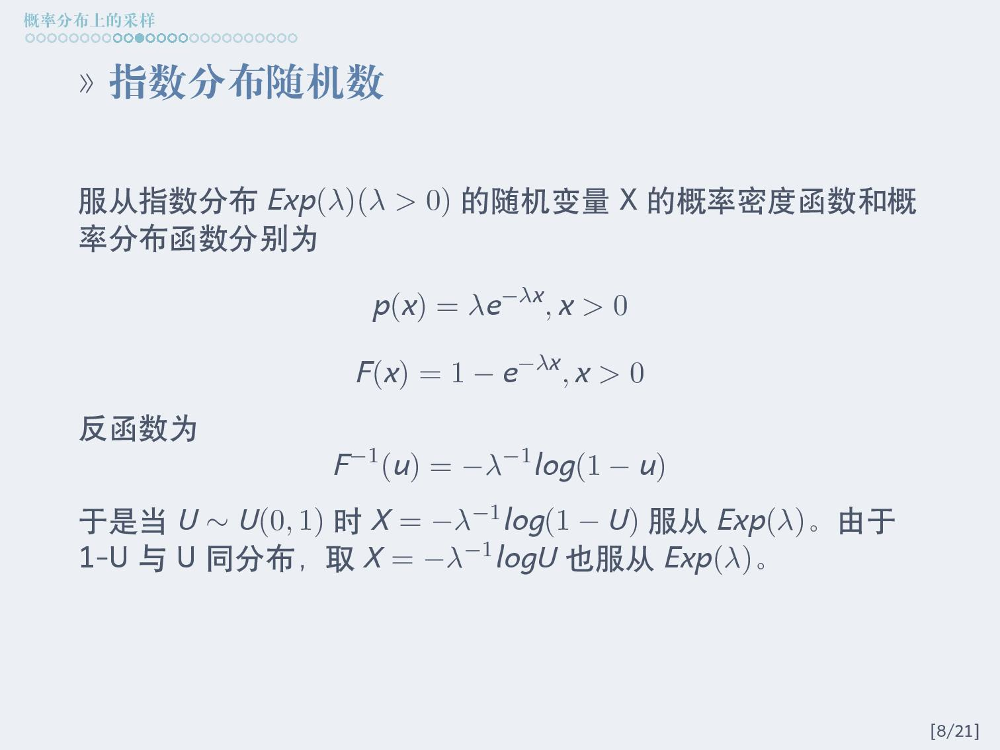
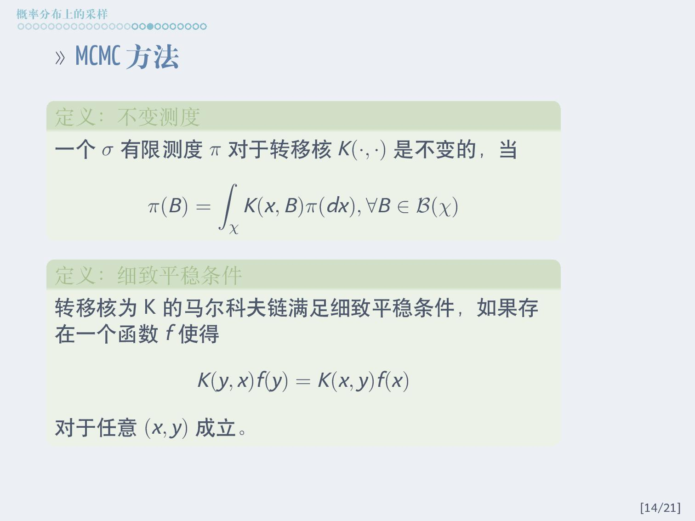

## Background

This post is a brief introduction to various methods of sampling from any given probability distribution. References include textbook and online introductions on Monte Carlo Statistical Methods and Statistical Computing.

## Slides

### Introduction

### Sampling from a uniform distribution

### Sampling from a non-uniform distribution

### Sampling from any distribution

